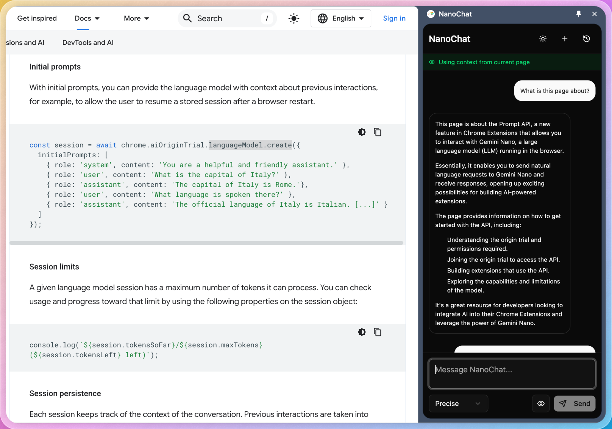

# NanoChat: On-device AI Chrome Extension

<div align="center">

<h2>A Chrome Extension that brings on-device AI to your browser using <a href="https://deepmind.google/technologies/gemini/nano/">Gemini Nano</a></h2>
</div>

## Overview

NanoChat leverages Chrome's built-in Gemini Nano model to provide AI assistance directly in your browser - no API keys, no cloud processing, everything runs locally on your device. With tab context awareness, NanoChat can understand and reference the content of your active page to provide more relevant responses.



## Features

- **100% On-device AI** - Uses Chrome's built-in AI capabilities through Gemini Nano
- **Tab Context Awareness** - Automatically extracts and uses content from your active tab
- **Chat History** - Easily access and continue previous conversations
- **Temperature Control** - Adjust the creativity of AI responses
- **Dark/Light Mode** - Toggle between themes for comfortable viewing
- **Persistent Storage** - Chat history is saved between browser sessions
- **Helpful Guidance** - Clear setup instructions if Chrome AI isn't available

## How It Works

NanoChat uses Chrome's experimental Gemini Nano API (available through an Origin Trial) to run AI inference directly on your device.

### Key Technical Components:

1. **AI Session Management**

   ```typescript
   // Create a new session with tab context and conversation history
   aiSessionRef.current = await chrome.aiOriginTrial.languageModel.create({
     temperature: tempValue,
     topK: 40,
     initialPrompts: initialPrompts,
   })
   ```

2. **Tab Context Extraction**

   ```typescript
   // Executes a script in the active tab to extract content
   const result = await chrome.scripting.executeScript({
     target: { tabId: tab.id },
     func: getPageContent,
   })
   ```

3. **Session Safety During Tab Changes**

   ```typescript
   // Don't destroy active sessions during tab changes
   const resetAISession = useCallback(() => {
     if (aiSessionRef.current) {
       if (sessionActive) {
         setPendingTabContextUpdate(true)
         return
       }
       aiSessionRef.current.destroy()
       aiSessionRef.current = null
     }
   }, [sessionActive])
   ```

4. **Dynamic Context Updates**
   ```typescript
   // Update context when tabs change
   chrome.tabs.onActivated.addListener((activeInfo) => {
     if (useTabContext) {
       fetchTabContext()
     }
   })
   ```

## Installation

### Requirements

- Chrome version 127 or newer
- Enabled Chrome flags for AI features

### Setup Instructions

1. **Clone the repository**

   ```
   git clone https://github.com/abpai/nanochat.git
   cd nanochat
   ```

2. **Install dependencies**

   ```
   npm install
   ```

3. **Build the extension**

   ```
   npm run build
   ```

4. **Load in Chrome**

   - Open Chrome and go to `chrome://extensions`
   - Enable "Developer mode" in the top-right corner
   - Click "Load unpacked" and select the `dist_chrome` folder

5. **Enable Chrome AI Features**
   - Visit `chrome://flags/#prompt-api-for-gemini-nano` and enable it
   - Visit `chrome://flags/#optimization-guide-on-device-model` and enable it
   - Restart Chrome
   - Visit `chrome://components` and update "Optimization Guide On Device Model"

## Usage

1. Click the NanoChat extension icon in your toolbar or open the side panel
2. Type your question in the input field
3. Toggle the "eye" icon to include/exclude page context
4. Adjust temperature settings for more creative or precise responses
5. View and continue previous conversations using the history button

## Technologies Used

- [Chrome Extension with Manifest V3](https://developer.chrome.com/docs/extensions/mv3/)
- [Chrome's Gemini Nano API](https://developer.chrome.com/docs/ai/built-in)
- [React 19](https://react.dev/)
- [TypeScript](https://www.typescriptlang.org/)
- [TailwindCSS 4](https://tailwindcss.com/)
- [Vite](https://vitejs.dev/)

## Credits

- Built using [vite-web-extension](https://github.com/JohnBra/vite-web-extension) template
- Inspired by the [Gemini On-Device Sample](https://github.com/GoogleChrome/chrome-extensions-samples/tree/main/functional-samples/ai.gemini-on-device) from Google Chrome Extensions Samples

## Privacy

NanoChat processes all data locally on your device. No queries, page content, or conversation history are sent to external servers. All data is stored locally in your browser.

## License

MIT

---

## Origin Trial Notice

To use this extension with the Gemini Nano API, you need to enable the Chrome AI features as described in the setup instructions. This feature is currently part of an Origin Trial and may change before the stable release.

[Learn more about Chrome AI](https://developer.chrome.com/docs/ai/built-in)
[Setup instructions](https://developer.chrome.com/docs/ai/get-started)
